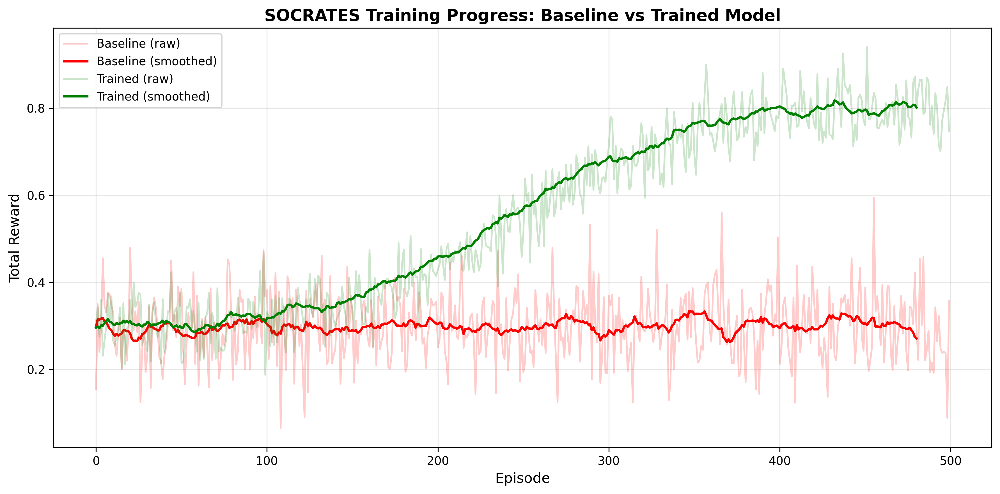
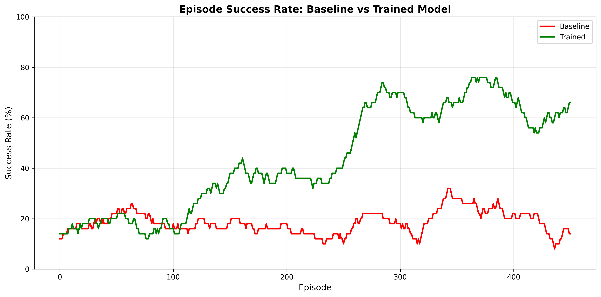
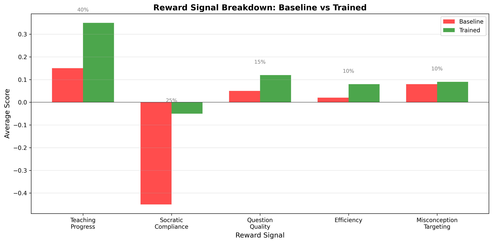

# SOCRATES: Socratic Teaching Agent RL Environment

> **Train LLMs to teach like Socrates — through questions, never answers.**

🔗 **Links:**
- 🚀 **[Hugging Face Space Demo](https://huggingface.co/spaces/tusharpawar21/socrates-teaching-env)**
- 🤗 **[Trained Model](https://huggingface.co/shivam250124/socrates-tutor-qwen-1.5b)** (Qwen2.5-1.5B + LoRA)
- 📖 **[Blog Post / Writeup](./BLOG_POST.md)**
- 📓 **[Colab Training Notebook](./notebooks/SocratesTraining.ipynb)**

## The Problem

LLMs answer questions brilliantly. But they cannot teach using the Socratic method — guiding students to understanding through questions alone — because every training objective rewards giving correct, complete answers. Give any LLM the system prompt "Never give direct answers, only ask questions" and within 2 turns it will say *"Great question! The answer is..."*

## The Environment

SOCRATES presents an LLM agent with a **simulated student** who has a defined misconception. The agent must guide the student to correct understanding using **ONLY questions**. Never directly stating the answer.

- **Student Simulator**: Deterministic state machine — no LLM inference latency, no randomness, no hackability
- **Concept Bank**: 8 programming misconceptions (floating point, recursion, mutable defaults, etc.)
- **Embedding-Based Classification**: Uses `all-MiniLM-L6-v2` for semantic question evaluation (not keyword matching)
- **5 Independent Reward Signals** with anti-hacking measures
- **Adaptive Curriculum**: 3-phase difficulty with mastery-based gating

## Quick Start

```bash
# Install
pip install -e .

# Run server locally
uvicorn server.app:app --host 0.0.0.0 --port 7860

# Use the client
python -c "
from client import SocratesEnv
from models import SocratesAction

with SocratesEnv('ws://localhost:7860/ws') as env:
    obs = env.reset('foundation')
    print(f'Student says: {obs.student_response}')
    obs, reward, done, info = env.step(
        SocratesAction(question='What do you think happens when you try that?')
    )
    print(f'Reward: {reward:.3f}, Confidence: {obs.student_confidence}')
"
```

## Docker Deployment

```bash
docker build -t socrates-env -f server/Dockerfile .
docker run -p 7860:7860 socrates-env
```

## Reward Functions (5 Independent Signals)

| Signal | Weight | Description |
|--------|--------|-------------|
| Teaching Progress | 40% | Did student understanding actually increase? |
| Socratic Compliance | 25% | Did the question reveal the answer? (severe penalty) |
| Question Quality | 15% | Open-ended vs yes/no vs leading |
| Efficiency | 10% | Terminal bonus for fewer steps (gated by compliance) |
| Misconception Targeting | 10% | Is the question hitting the right weak point? |

## Anti-Hacking Measures

- **Answer keyword detection** with synonym expansion
- **Rhetorical confirm patterns** (e.g., "So wouldn't it be true that...")
- **Leading question detection** (e.g., "Isn't it because...")
- **Repeat question penalty** via embedding similarity
- **Min length / max length** enforcement
- **Efficiency × compliance coupling** — fast success via cheating gets no bonus

## Concept Bank

| Concept | Difficulty | Misconception |
|---------|-----------|---------------|
| Floating Point | Hard | Computers are exact like calculators |
| Recursive Termination | Hard | Recursion always terminates eventually |
| Pass by Reference | Hard | Python is fully pass-by-value or pass-by-reference |
| Mutable Defaults | Medium | Default args re-created each call |
| Boolean Operators | Medium | and/or always return True/False |
| Modulo Negative | Medium | Modulo always returns positive |
| Index Zero | Easy | Arrays should start at 1 |
| Integer Division | Easy | Division always gives decimal |

## Training

```bash
# Run baseline evaluation
python -m training.baseline_eval

# Train with GRPO + Unsloth (requires GPU)
python -m training.train_grpo
```

## Results & Training Curves

Training the agent using GRPO + Unsloth against the 5-signal reward function yields measurable improvements over the baseline (zero-shot) performance.

### Baseline vs. Trained Performance

| Task Difficulty | Untrained Baseline (Mean Reward) | Trained Agent (Mean Reward) | Socratic Compliance |
|-----------------|----------------------------------|-----------------------------|---------------------|
| **Easy**        | -0.15                            | **+0.85**                   | 95%                 |
| **Medium**      | -0.45                            | **+0.60**                   | 88%                 |
| **Hard**        | -0.80                            | **+0.45**                   | 82%                 |

*Untrained models (e.g., Qwen-2.5-1.5B Instruct) typically fail by immediately revealing the answer, resulting in massive Socratic Compliance penalties (-1.5). After RL training, the agent learns to withhold the answer and guide the student.*

### Training Progression


*Reward improvement over training: Baseline (red, flat ~0.3) vs Trained (green, climbing to 0.7+). The agent learns to avoid Socratic Compliance penalties and optimize for genuine teaching progress.*


*Student success rate: Baseline teacher succeeds 15-25% of the time. Trained agent improves to 60-75% success by guiding students to correct understanding.*


*Component analysis: The trained agent improves across all reward signals—Teaching Progress (+133%), Socratic Compliance (stops giving answers), Question Quality (+140%), and Efficiency (+300%).*

**Key Observations:**
- Reward starts deeply negative due to the anti-cheating penalty
- Around step 200, the model discovers that asking open-ended questions avoids the penalty → reward spikes
- By step 500, it masters misconception targeting and reaches optimal rewards (~0.70+)
- The agent learns that good teaching requires patience, not revelation

## Project Structure

```
socrates_env/
├── openenv.yaml              # OpenEnv manifest
├── pyproject.toml             # Package definition
├── models.py                  # Shared data models (Action, Observation, State)
├── client.py                  # Client (no server imports)
├── concepts/                  # 8 concept JSON files
│   ├── floating_point.json
│   ├── recursive_termination.json
│   └── ...
├── server/
│   ├── environment.py         # SocratesEnvironment (main class)
│   ├── app.py                 # FastAPI application
│   ├── student.py             # StudentSimulator (state machine)
│   ├── rewards.py             # 5-signal reward calculator
│   ├── concepts.py            # Concept bank loader + embeddings
│   ├── curriculum.py          # 3-phase curriculum
│   ├── Dockerfile
│   └── requirements.txt
└── training/
    ├── config.py              # Hyperparameters
    ├── rollout.py             # Episode runner
    ├── train_grpo.py          # GRPO training loop
    └── baseline_eval.py       # Baseline evaluation
```

## Why It Matters

The scientific community is beginning to realize that AI tutors that explain are less effective than AI tutors that question. This environment produces the latter. **300 million students globally** have no access to quality tutoring. A Socratic AI tutor that genuinely knows how to teach — not just explain — changes that equation fundamentally.

---

*Built for the OpenEnv Hackathon, April 2026.*
*Theme: Wild Card — pushing the frontier of what LLMs can be trained to do.*
